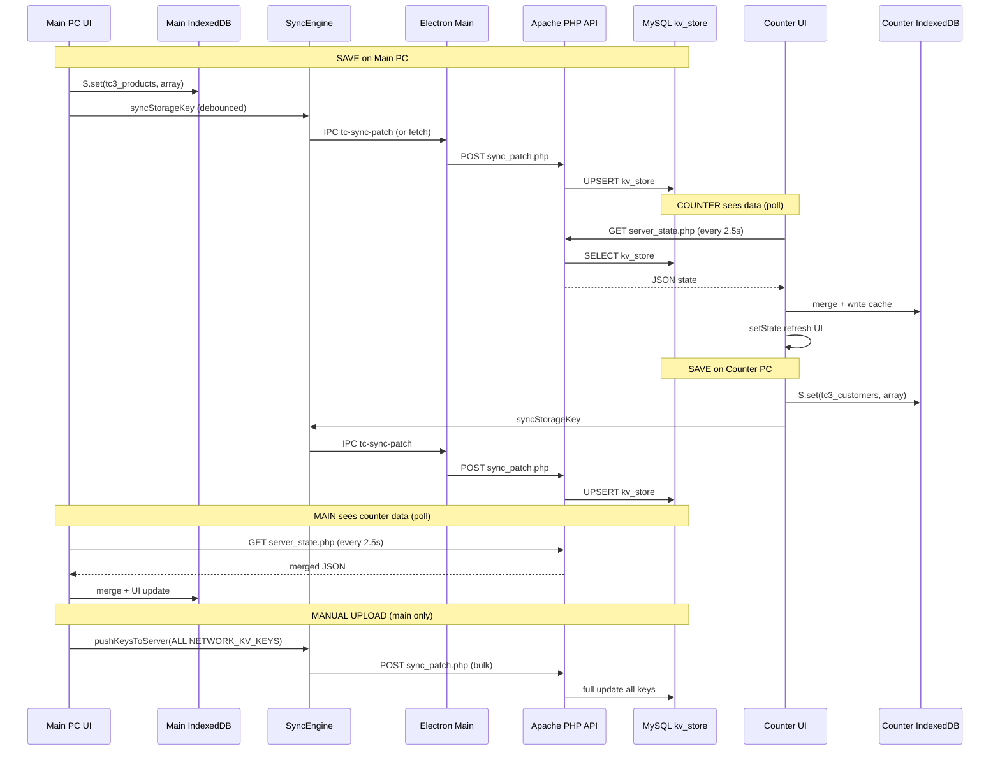

# TechonERP — Complete Technical Architecture Report

*Generated from source code analysis of the TechonERP repository. No code was modified. This documents what exists in the codebase.*

**Repository:** `C:/Users/RASHID/Desktop/TechonERP`  
**Desktop app:** `erp-app/`  
**App version:** 2.0.0 (from `erp-app/package.json`)

---

## 1. PROJECT OVERVIEW

### What is TechonERP?

TechonERP is a **desktop Electron ERP application** for retail / computer-shop businesses. It covers POS (sales), inventory, customers, suppliers, purchases, expenses, repairs, quotations, invoicing, accounts/GL, reports, barcodes, and licensing. It can run as a **single PC** or as a **multi-PC LAN setup** (main server + counter POS terminals).

### Overall architecture

```
┌─────────────────────────────────────────────────────────────────┐
│  Electron Main Process (main.cjs)                               │
│  License, XAMPP control, IPC, LAN HTTP (lanPost), backups       │
└───────────────────────────┬─────────────────────────────────────┘
                            │ IPC (preload.js → electronAPI)
┌───────────────────────────▼─────────────────────────────────────┐
│  Renderer (React) — LicenseGate → SetupWizard → App.jsx         │
│  Local storage: IndexedDB + localStorage mirror (tc3_* keys)      │
│  SyncEngine.js — push/pull vs LAN PHP API                       │
└───────────────────────────┬─────────────────────────────────────┘
         Standalone          │ Network modes
              │               ▼
              │    ┌──────────────────────────────┐
              │    │ XAMPP (Main PC only)         │
              │    │ Apache → PHP network-api     │
              │    │ MySQL → techon_erp_network   │
              │    └──────────────────────────────┘
              │               ▲
              │    Counter PCs pull/push via HTTP
              ▼
     IndexedDB only (no shared MySQL)
```

Separate from LAN sync, there is an **optional cloud sync** to `https://api.techon.lk` and a **license server** at `license.techon.lk` (under `public_html/`).

### Main technologies

| Layer | Technology |
|--------|------------|
| Desktop shell | **Electron ^40.8.0** (`package.json`) |
| UI | **React ^19.2.0**, **React DOM ^19.2.0** |
| Bundler | **Vite ^7.3.1** (`@vitejs/plugin-react`) |
| Language | Mostly **JavaScript (.jsx/.js)**; TypeScript config exists (`tsconfig.json`) but primary UI is JSX |
| LAN backend | **PHP** scripts in `erp-app/network-api/` (no Laravel/Symfony) |
| LAN database | **MySQL** via **PDO** (no ORM) |
| Local database | **IndexedDB** (`techon_erp_v1`, object store `kv`) + `localStorage` mirror for `tc3_*` keys |
| State management | **React `useState` in `App.jsx`** + global synchronous storage object **`S`** (`get`/`set` on `_idbCache`) — **not Redux/Zustand** |
| Printing | Electron hidden `BrowserWindow` + IPC (`tc-print-html`, `tc-print-html-disk-chunk`) |
| Build / package | **electron-builder** (NSIS Windows installer), `npm run build` → `dist/`, `npm run dist` → `release/` |

### Versions (from `erp-app/package.json`)

- **Electron:** `^40.8.0`
- **React:** `^19.2.0`
- **App version:** `2.0.0`

---

## 2. PROJECT FOLDER STRUCTURE

Repository root: `TechonERP/`

| Path | Purpose |
|------|---------|
| **`erp-app/`** | Main Electron desktop application (the product users install) |
| **`erp-app/src/`** | React renderer source: pages, sync, licensing, accounting, utils |
| **`erp-app/main.cjs`** | Electron main process entry (`package.json` `"main"`) |
| **`erp-app/preload.js`** | `contextBridge` → `window.electronAPI` |
| **`erp-app/network-api/`** | PHP LAN API copied to XAMPP `htdocs/api/` on server setup |
| **`erp-app/dist/`** | Vite production build output (loaded when not using dev server) |
| **`erp-app/release/`** | electron-builder installers (`Techon-ERP Setup 2.0.0.exe`, etc.) |
| **`erp-app/scripts/`** | Tests, seed data, CI, release gates |
| **`erp-app/docs/`** | `RUNBOOK.md` operations guide |
| **`public_html/api.techon.lk/`** | Hosted **cloud backup/sync** PHP API |
| **`public_html/license.techon.lk/`** | License activation/verification admin + API |
| **`public_html/site/`** | Marketing website (Vite/React) |
| **`docs/`** | Release checklist at repo level |
| **`.github/workflows/`** | CI pipeline |

### Important `erp-app/src/` subfolders

| Folder | Purpose |
|--------|---------|
| `pages/` | Feature screens: Sales, Inventory, Customers, Settings, etc. |
| `sync/SyncEngine.js` | LAN sync push/pull logic |
| `licensing/` | `LicenseGate.jsx`, trial limits |
| `accounting/` | GL journal, inventory engine, reconciliation |
| `utils/` | Merge logic, search, normalization |
| `components/` | Shared UI widgets |
| `productionConfig.js` | `IS_PRODUCTION`, `COMPUTER_SHOP_EDITION` flags |

---

## 3. APPLICATION MODES

Mode is stored in **`%AppData%/TechonERP/UserData/tc_network.json`** (via Electron `userData` path). Loaded by main process (`loadNetworkConfig()` in `main.cjs`) and exposed to renderer via `electronAPI.loadNetworkConfig()`.

Roles: `standalone` | `network_server` | `network_client`

Chosen in **`SetupWizard.jsx`** on first run (unless `wizardComplete` is already true).

### A. Standalone Mode

**Startup flow**

1. `main.tsx` → `LicenseGate` → license check (`tc-license-status` IPC)
2. If `networkConfig.wizardComplete` is false → `SetupWizard` (user picks **Single Computer** → `standalone`)
3. Config saved → `App.jsx` renders

**Database**

- **Only local IndexedDB** (`techon_erp_v1` / store `kv`)
- **No MySQL**, no LAN PHP API on this PC (unless user installed XAMPP separately — not required for standalone)

**APIs**

- Optional: `https://api.techon.lk` for cloud sync (if user enables in Settings)
- License: external verify via main process (`tcRequest('/verify', ...)`)

**Data flow**

```
User action → Page calls S.set("tc3_*", value)
           → _idbCache + IndexedDB + localStorage mirror
           → React setState
```

No `SyncEngine` network activity (`role === 'standalone'` short-circuits sync).

### B. Multi-PC Main Computer Mode (`network_server`)

**Startup flow**

1. Setup wizard: user picks **Main Computer / Network Server**
2. `ServerSetup` in `SetupWizard.jsx` runs automated steps:
   - Detect/start **XAMPP** (Apache + MySQL)
   - Copy `network-api/` → `{xampp}/htdocs/api/`
   - Run `schema.sql` → database `techon_erp_network`
   - Generate API key → write `tc_api_key.php`
   - Build LAN URL from `getLanIp` (e.g. `http://192.168.x.x/api/`)
3. Save `tc_network.json`: `{ role: "network_server", apiUrl, apiKey, xamppPath, port, wizardComplete: true }`
4. `LicenseGate` → `App.jsx`
5. `App.jsx` initializes **SyncEngine** (`initSyncEngine`), pulls server state, starts periodic pull

**Backend services started (on main PC)**

- **Apache** (HTTP, default port **80** per config)
- **MySQL** (XAMPP default)
- PHP API at **`http://<LAN-IP>/api/`**

**Network configuration**

- File: `UserData/tc_network.json`
- API auth: **`X-TC-KEY`** header matching `htdocs/api/tc_api_key.php`

**Data flow (intended design)**

```
Main PC save → S.set → SyncEngine.syncStorageKey → sync_patch.php → MySQL kv_store
Counter PC   → server_state.php (poll) → merge → local IndexedDB → UI
```

### C. Counter Computer Mode (`network_client`)

**Startup flow**

1. Setup wizard: user picks **Counter Computer / Network Client**
2. User enters **server API URL** + **security key** (same as main's `apiKey`)
3. Save `tc_network.json`: `{ role: "network_client", apiUrl, apiKey, wizardComplete: true }`
4. License: main process reads license from **LAN** `check_license.php` (not cloud directly)
5. `App.jsx` with limited UI (POS-focused pages, `network_client` page allow-list)

**API URL**

- Stored in `tc_network.json` → `apiUrl` (e.g. `http://192.168.8.112/api/`)
- Must be reachable over LAN/Wi‑Fi

**Database usage**

- **Local IndexedDB** on counter (cache/working copy)
- **Does not run MySQL/XAMPP** — many server IPC methods are **blocked** in `preload.js` for client role

**Communication with main**

- HTTP to main PC's Apache:
  - **Pull:** `GET server_state.php` (every **2.5 s** when logged in)
  - **Push:** `POST sync_patch.php` on each `S.set` of syncable keys
  - **Health:** `GET ping.php` (connection monitor)
  - **License:** `check_license.php`

---

## 4. DATABASE

### Database engines

| Mode | Primary store | Shared hub |
|------|---------------|------------|
| Standalone | IndexedDB only | None |
| Network server | IndexedDB + MySQL | MySQL on main PC |
| Network client | IndexedDB only | Reads/writes via HTTP to main's MySQL |

### Connection method

- **MySQL:** PHP `PDO` in `network-api/config.php`  
  - Env: `DB_HOST`, `DB_NAME`, `DB_USER`, `DB_PASS` (`.env` or defaults: `localhost`, `techon_erp_network`, `root`, empty password)
- **IndexedDB:** `indexedDB.open("techon_erp_v1", 1)` in `App.jsx`

### Schema (`network-api/schema.sql`)

| Table | Purpose |
|-------|---------|
| **`kv_store`** | `store_key` + JSON `value` — mirrors all `tc3_*` ERP keys |
| **`audit_log`** | Server-side audit rows |
| **`client_sessions`** | Connected terminal sessions |
| **`processed_patches`** | Idempotency for sync patch IDs |
| **`shop_license`** | Single-row license snapshot for LAN clients |
| **`connected_clients`** | Device IDs for max-client licensing |

**There are no normalized relational tables for products/customers/sales** — business data lives as **JSON blobs** in `kv_store`.

### Do both PCs use the same database?

- **Logically yes** (network mode): shared truth is **MySQL `kv_store` on main PC**
- **Physically no**: each PC has its own **IndexedDB** copy, kept in sync via HTTP

### Database switching

- Mode is fixed in `tc_network.json` at setup; not switched at runtime without reset/reconfigure
- `SetupWizard` / Settings can reset network config
- On network startup, app **merges** server JSON into local cache (`mergeServerStateWithLocal`)

---

## 5. API ARCHITECTURE

### LAN API (`erp-app/network-api/`)

**Not MVC.** Each endpoint is a **standalone PHP file** including `config.php`.

| File | Method | Auth | Purpose |
|------|--------|------|---------|
| `ping.php` | GET | No | Health + DB check |
| `health_check.php` | GET | Yes | Extended health |
| `server_state.php` | GET | Yes | Full/partial `kv_store` read |
| `sync_patch.php` | POST | Yes | Write `kv_store` patches |
| `get_products.php` | GET | Yes | Active products for POS |
| `get_customers.php` | GET | Yes | Customers list |
| `check_license.php` | GET/POST | Yes | License + client registration |
| `save_license.php` | POST | Yes | License snapshot from main |
| `merge_records.php` | — | — | PHP merge helpers (included) |

**Auth:** `X-TC-KEY` header vs `tc_api_key.php` (except `ping.php`).  
**Client tracking:** `X-TC-Client-ID` header.

### Cloud API (`public_html/api.techon.lk/`)

Separate system: `login.php`, `sync.php`, `get_data.php`, etc. Used only if user enables **cloud sync** in Settings (`tc3_cloud_sync`).

### Which APIs each mode uses

| Endpoint | Standalone | Main PC | Counter PC |
|----------|------------|---------|--------------|
| LAN `ping.php` | No | Yes | Yes |
| LAN `server_state.php` | No | Yes | Yes |
| LAN `sync_patch.php` | No | Yes | Yes |
| LAN `check_license.php` | No | Yes (server) | Yes (client) |
| Cloud `api.techon.lk` | Optional | Optional | Optional |
| License cloud verify | Yes (main) | Yes (main) | No (uses LAN) |

---

## 6. MULTI-PC SYSTEM (most important)

### How counter connects

1. User enters **manual API URL** + **API key** during setup (no auto-discovery protocol in code — **no mDNS/Bonjour**)
2. Main PC's LAN IP is obtained during server setup via `tc-get-lan-ip` IPC
3. Counter stores URL in `tc_network.json`

### How main is "discovered"

- **Not automatic on counter.** User must type URL (or copy from main Settings → Network).
- Counter tests connection via **`ping.php`** on an interval (`App.jsx` connection monitor).

### How API URL is stored

- **File:** `{Electron userData}/tc_network.json`
- Example fields: `role`, `apiUrl`, `apiKey`, `xamppPath`, `port`, `wizardComplete`
- Loaded: `ipcMain.handle('tc-network-config-load')` → renderer

### Authentication

- **LAN data API:** shared secret `apiKey` → HTTP header `X-TC-KEY`
- **License on counter:** `check_license.php?deviceId=...&deviceName=...` with same key
- **Cloud license (main/standalone):** separate cloud API + `LICENSE_SECRET` / `tc_license_secret.txt` in packaged builds

### Connection testing

- `App.jsx`: periodic `fetch(apiUrl + 'ping.php')` with `X-TC-KEY`
- Sets `connStatus`: `connected` | `disconnected` | `reconnecting` | `unknown`
- **Counter periodic pull is skipped when `connStatus === 'disconnected'`**

### How data is synchronized (designed behavior)

**Two mechanisms:**

1. **Push (on write)** — `S.set` in `App.jsx`:
   - If `window._tcNetRole` is `network_server` or `network_client`
   - Calls `TC_SYNC.syncStorageKey(key, value)` for keys in `NETWORK_KV_KEYS`
   - Debounced (**100 ms** for record tables, **600 ms** for others)
   - Sends to `sync_patch.php` via:
     - **Primary:** main process IPC `electronAPI.syncPatch` → `lanPost` in `main.cjs`
     - **Fallback:** renderer `fetch` in `SyncEngine.js`

2. **Pull (polling)** — every **`CLIENT_PULL_INTERVAL_MS` = 2500 ms**:
   - `loadStateFromServer` → `GET server_state.php`
   - `mergeServerStateWithLocal` (newest `updatedAt`/`createdAt` per record `id`)
   - Write to IndexedDB + `setState(loadState())`

**No WebSocket, no Socket.IO, no SSE for LAN sync.**

### How "Upload Shop Data to Server" works

**UI:** Settings → Network → **"Upload Shop Data to Server"** (`Settings.jsx`)  
**Visible only on `network_server`.**

**Code path:**

```
Settings button
  → pushKeysToServer(NETWORK_KV_KEYS, { authConfig: systemConfig })
  → reads ALL keys from window._idbCache
  → sendBatch → POST sync_patch.php (many keys at once)
  → MySQL kv_store updated
```

**Files involved:** `Settings.jsx`, `SyncEngine.js` (`pushKeysToServer`, `sendBatch`), `sync_patch.php`, `merge_records.php`

**Database operations:** For each key, PHP reads existing `kv_store` row, merges or applies full-array snapshot, UPSERTs JSON.

### Complete data flow diagram



---

## 7. LIVE DATA FLOW (counter creates records)

Example: **Counter creates a customer**

| Step | What happens |
|------|----------------|
| 1 | User saves in `Customers.jsx` → `S.set("tc3_customers", newArray)` |
| 2 | `_coreStorageSet` updates `_idbCache`, IndexedDB, localStorage |
| 3 | `S.set` calls `TC_SYNC.syncStorageKey("tc3_customers", value)` if network mode |
| 4 | After ~100 ms debounce, `syncStorageKeyNow` runs |
| 5 | POST `sync_patch.php` with full `tc3_customers` array |
| 6 | PHP merges into MySQL `kv_store` |
| 7 | Main PC next poll (≤2.5 s) → `server_state.php` |
| 8 | `mergeServerStateWithLocal` merges server + local by record `id` |
| 9 | Main UI updates via `setState(loadState())` |

**Where stored first:** Counter **IndexedDB** immediately; **MySQL** after successful patch.

**When main receives it:** On next **pull interval**, not instant push notification.

Same pattern for: products (`Inventory.jsx`), sales (`Sales.jsx`), expenses, purchases, suppliers, quotations (`Invoices.jsx`), etc. — all use `S.set` on `tc3_*` keys listed in `NETWORK_KV_KEYS`.

**Payments / stock:** Typically bundled in `tc3_sales`, `tc3_products`, `tc3_purchases` array updates, not separate tables.

---

## 8. REAL-TIME SYSTEM

| Mechanism | Used for LAN sync? |
|-----------|-------------------|
| **HTTP polling** | **Yes** — 2.5 s pull (`CLIENT_PULL_INTERVAL_MS`) |
| **Debounced HTTP push** | **Yes** — on `S.set` |
| WebSocket | **No** |
| Socket.IO | **No** |
| Server-Sent Events | **No** |
| MySQL triggers | **No** |
| Background services | Electron `setInterval` in renderer + main process license sync timers |
| Cron jobs | **No** in desktop app; PHP has patch GC on request |

**"Live sync" in this codebase means polling + debounced push, not sub-second real-time.**

---

## 9. LOCAL SERVER (XAMPP)

### How XAMPP is used

- **Main PC only** (client role blocks XAMPP IPC in `preload.js`)
- Setup wizard / Settings can:
  - `tc-check-xampp`
  - `tc-start-xampp-services` → `httpd.exe`, `mysqld.exe`
  - `tc-copy-api-files` → `network-api` → `{xampp}/htdocs/api/`
  - `tc-setup-database` → imports `schema.sql`
  - `tc-write-api-key` → `tc_api_key.php`

### Apache

- Serves PHP from `htdocs/api/`
- Default port **80** (`tc_network.json` `port` field)

### MySQL

- Database: **`techon_erp_network`**
- User/password: defaults `root` / empty (XAMPP)

### Electron integration

- Main process spawns XAMPP binaries (`spawnBackground`)
- API files bundled in installer `extraResources/network-api`
- Dev: `erp-app/network-api/`

---

## 10. CONFIGURATION FILES

| File / location | Purpose |
|-----------------|---------|
| `UserData/tc_network.json` | Mode, `apiUrl`, `apiKey`, XAMPP path |
| `UserData/` license files | Trial/activation state (main process) |
| `resources/tc_license_secret.txt` | Packaged license HMAC secret |
| `network-api/.env` | MySQL credentials (optional) |
| `network-api/tc_api_key.php` | Generated API key (not in git) |
| `xampp/htdocs/api/tc_api_key.php` | Deployed copy on server |
| `src/productionConfig.js` | `IS_PRODUCTION`, `COMPUTER_SHOP_EDITION` |
| `vite.config.ts` | Build settings |
| `electron-builder` config in `package.json` | Installer packaging |

**Environment variables (PHP):** see `network-api/env.example.txt` — `DB_*`, `TECHON_ERP_OPEN_API`, CORS settings.

---

## 11. ELECTRON ARCHITECTURE

### Main process (`main.cjs`)

- Window lifecycle, splash screen
- License verification, device binding, clock tamper checks
- XAMPP / DB setup / API key generation
- `lanGet` / `lanPost` HTTP from Node (used for license sync and `tc-sync-patch`)
- File backups to `Documents/TechonERP/backups/`
- Logging to `Documents/TechonERP/logs/`

### Renderer

- React app in `src/`
- No Node integration in renderer (uses preload bridge)

### Preload (`preload.js`)

- `contextBridge.exposeInMainWorld('electronAPI', {...})`
- **Client role guards** block many server-only methods via `CLIENT_BLOCKED_METHODS`
- `syncPatch` is **not** blocked on counter (available for live sync)

### IPC examples

`tc-license-status`, `tc-network-config-load`, `tc-sync-patch`, `tc-print-html`, `save-backup`, `tc-start-xampp-services`, etc.

### Printing

- HTML invoice/thermal generated in renderer
- Sent to main via `tc-print-html` or chunked disk write for large HTML
- Silent print via hidden `BrowserWindow`

### Auto updater

- **Not present** in codebase (no `electron-updater` / `autoUpdater` in `main.cjs`)

### License system

- Wrapped by `LicenseGate.jsx` before `App` renders
- Trial limits in `trialLimits.js` (20 records/module)
- Network client reads license from LAN server snapshot

---

## 12. LICENSE SYSTEM

### How it works

- **Trial:** time-limited + per-module record caps (`TRIAL_MAX_RECORDS = 20`)
- **Activated:** cloud verify via main process; snapshot synced to MySQL on network server
- **Network client:** never calls cloud directly; uses `check_license.php` on main PC
- **Device binding:** `deviceId` stored with license; mismatch can lock app
- **Read-only mode:** expired license, trial limits, offline timeout, clock tamper

### Activation

- User enters license key in `LicenseGate` UI → `tc-activate` IPC → cloud API

### Internet usage

- Main/standalone: cloud license verify (when online)
- Optional cloud ERP sync to `api.techon.lk`
- LAN mode data sync: **local network only** (no internet required for POS sync)

### Offline

- Network client: cached license up to **2 hours** (per comments in `main.cjs`); then may lock
- Standalone: offline verify with grace rules in main process

---

## 13. CURRENT KNOWN ISSUES (document behavior only)

### Multi-PC sync — reported behavior vs code

Users report:

1. **Main → Counter:** data appears on counter **only after** Settings → **"Upload Shop Data to Server"** on main
2. **Counter → Main:** counter records **never** appear on main
3. **Deletes on main** (e.g. quotations) **reappear** within ~2 seconds

### Why "Upload Shop Data" exists (from code)

`Settings.jsx` documents it explicitly:

> *"Use Upload Shop Data to Server if counter PCs cannot see products or invoices (pushes this PC's data into MySQL)."*

It is a **manual bulk recovery** path when automatic sync does not populate `kv_store`.

Internally it:

- Reads **entire** `window._idbCache` for all `NETWORK_KV_KEYS`
- POSTs all keys in one batch to `sync_patch.php`
- Does **not** depend on debounced per-key `syncStorageKey` having succeeded earlier

### Why automatic push may not update MySQL (code-based factors)

| Factor | Detail |
|--------|--------|
| **Sync only for `NETWORK_KV_KEYS`** | `syncStorageKey` ignores keys not in `NETWORK_KV_KEYS` set |
| **`S.set` must reach sync hook** | Blocked if `evaluateLicenseStorageWrite` or `validateAccountingMutation` returns blocked (early `return` before sync) |
| **`getActiveConfig()` must be valid** | Requires `role !== 'standalone'` and `apiUrl`; config from `ensureSyncConfig` / `window._tcNetSyncConfig` |
| **Debounce delay** | 100–600 ms before push; failures during pull/hydration were historically deferred |
| **Packaged vs dev mismatch** | Main may run `npx electron .` with latest `dist/`; counter may run **older installed `.exe`** with different sync code |
| **Logging** | Sync logs use `[SyncEngine]` via `writeLog` IPC — if push never runs, logs may show no sync lines |
| **Counter pull blocked** | When `connStatus === 'disconnected'`, periodic pull does not run (push may still run via IPC) |

### Why main may not see counter records (code-based factors)

| Factor | Detail |
|--------|--------|
| **Counter push must reach `sync_patch.php`** | Same `syncStorageKey` path; counter `tc_network.json` must have correct `apiUrl` + `apiKey` |
| **Main learns via poll only** | No push notification; up to **2.5 s** delay even if server updated |
| **Merge is additive by id** | `mergeRecordArraysByNewest` keeps records present on server; deletes require server to receive **full array snapshot** without deleted ids (`tcApplyFullArraySnapshot` in PHP for non-chunk patches) |
| **Pull can restore deleted rows** | If delete never reached MySQL, next pull merges server copy back → **quotation reappears ~2 s** (matches poll interval) |

### Delete / reappear behavior (explained from architecture)

1. User deletes quotation locally → `S.set("tc3_quotations", filteredArray)`
2. If push **fails or is delayed**, MySQL still has old quotation
3. ~2.5 s later: `pullFromServer` → `mergeServerStateWithLocal` → server record merged back into local state
4. UI shows quotation again

This matches **polling interval** and **server-as-source-of-truth when push fails**.

### Other known issues (from code/comments)

- React hooks ordering bug was fixed in `SetupWizard.jsx` (historical crash on server setup)
- Shop name merge conflicts between main/counter settings (`mergeSettingsFromServer`)
- License post-save verify warnings in logs (`Client identification is invalid`)
- `COMPUTER_SHOP_EDITION = true` changes wizard flow and admin UI behavior
- No auto-updater — version drift between PCs is likely if not rebuilt together
- White screen crash was caused by `NETWORK_KV_KEYS` used before declaration in `SyncEngine.js` (fixed in codebase)

### Key source files for sync investigation

| File | Role |
|------|------|
| `erp-app/src/App.jsx` | `S.set`, sync init, periodic pull, `window._tcNetRole` |
| `erp-app/src/sync/SyncEngine.js` | `syncStorageKey`, `pushKeysToServer`, `loadStateFromServer` |
| `erp-app/src/utils/mergeRecordArrays.js` | Client-side merge on pull |
| `erp-app/network-api/sync_patch.php` | Server write path |
| `erp-app/network-api/server_state.php` | Server read path |
| `erp-app/network-api/merge_records.php` | Server array merge / full snapshot |
| `erp-app/main.cjs` | `tc-sync-patch` IPC, `lanPost`, XAMPP, network config |
| `erp-app/preload.js` | `electronAPI.syncPatch`, client guards |
| `erp-app/src/pages/Settings.jsx` | Manual "Upload Shop Data to Server" |

---

## 14. IMPROVEMENT SUGGESTIONS (future, no architecture change stated)

*High-level only — not implementation plans.*

- Versioned sync protocol with explicit **delete tombstones**
- **Sync health UI** showing last push/pull per key and last error
- **Forced rebuild alert** when main/counter app versions differ
- Shorter poll interval or **push-triggered pull** on peer after successful patch
- Integration tests for full main↔counter round-trip
- Single "sync status" dashboard on main showing `kv_store` row counts vs local
- Counter setup: QR/copy URL from main Settings
- Structured sync audit table on server (who pushed what, when)

---

## 15. FINAL SUMMARY

**TechonERP** is an **Electron + React** desktop ERP with **local-first storage (IndexedDB)**. In **network mode**, the **main PC runs XAMPP** (Apache + MySQL) and hosts a **PHP key-value API** that mirrors the same `tc3_*` JSON structure as IndexedDB.

**Counter PCs** are thin clients: local cache + POS UI, talking HTTP to the main PC. **Sync is not real-time pub/sub** — it is **debounced HTTP push on save** plus **2.5-second HTTP polling pull**, with **record-level merge by `id` and timestamp**.

**Manual "Upload Shop Data"** bulk-pushes all local keys to MySQL and exists as a **documented fallback** when automatic per-key sync does not keep `kv_store` current.

**Licensing** is separate from business sync: cloud on main, LAN snapshot for counters. **Optional cloud sync** to `api.techon.lk` is a third, independent pipeline.

A senior architect reviewing sync failures should focus on: **(1)** whether `sync_patch.php` receives writes on save vs only on manual upload, **(2)** whether counter and main run the **same build**, **(3)** whether `tc_network.json` on each PC is correct, **(4)** whether MySQL `kv_store` actually changes after counter saves, and **(5)** the **poll-based merge** behavior that can **undo local deletes** if server was never updated.

---

*End of report.*
